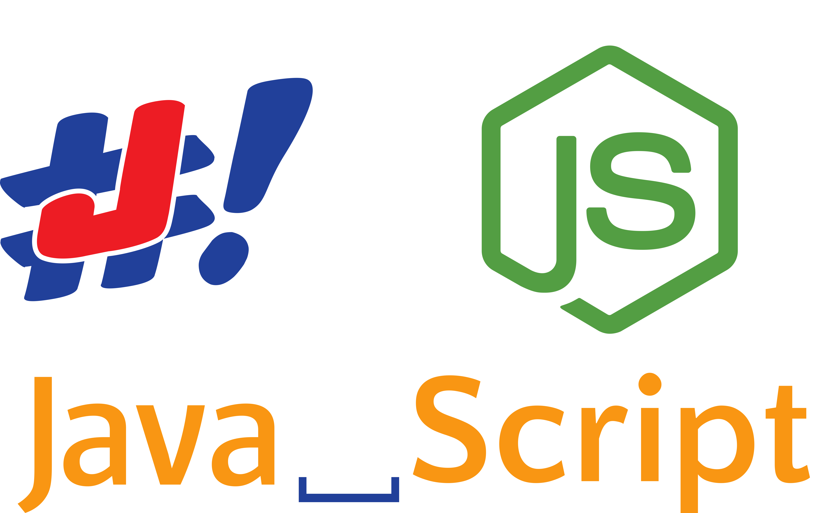

# jbang-npm - Java Script in your JavaScript <!-- omit in toc -->

Install and use [JBang](https://www.jbang.dev) from NPM based projects.



Lets you use your own local scripts, [JBang AppStore](https://jbang.dev/appstore) alias or any network reachable jar or Maven artifact.

# Table of Contents <!-- omit in toc -->

- [Installation](#installation)
- [Usage](#usage)
  - [As a library](#as-a-library)
    - [exec(string)](#execstring)
  - [As a CLI](#as-a-cli)
- [Behind the scenes](#behind-the-scenes)
- [Using as a dependency](#using-as-a-dependency)

## Installation

`npm i @jbangdev/jbang --save`

Prefer installing the package globally if you want to use it as a CLI wrapper of `JBang`:

`npm i -g @jbangdev/jbang`

## Usage

You can find the complete documentation about arguments you can pass to the `jbang` executable here: https://www.jbang.dev/documentation/guide/latest/cli/jbang.html.

### As a library

```js
const jbang = require('@jbangdev/jbang');
```

`jbang` is an object exposing the following.

#### exec(string)

The `jbang.exec()` function accepts a string that will be passed as the command-line arguments to the `jbang` executable.

Example:

```js
jbang.exec('app install --name karate-core com.intuit.karate:karate-core:RELEASE:all');
```

### As a CLI

Package preferably installed globally, you can run in a shell the command named `jbang`.

Example:

`jbang app install --name karate-core com.intuit.karate:karate-core:RELEASE:all`

## Behind the scenes

When you run `npm install` - JBang and other dependencies will be installed via the [npm `preinstall`](https://docs.npmjs.com/cli/v8/using-npm/scripts#npm-install) hook. This uses the [`app setup`](https://www.jbang.dev/documentation/guide/latest/installation.html#using-jbang) command.

## Using as a dependency

In most cases you should be able to use JBang directly in node scripts.

But if you want to provide more customization you can create your own "wrapper" NPM package. One of the advantages is that you can pre-install the library dependencies needed at the time of `npm install` (just by calling `--help` or a similar "no op" command) so that the user-experience when running the first command after install is better.

For an example, refer to the [`@karatelabs/karate`](https://github.com/karatelabs/karate-npm) NPM package.
